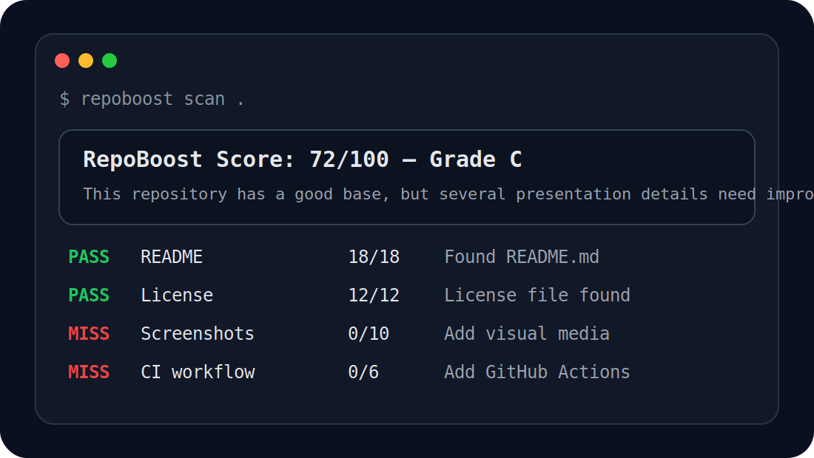

# RepoBoost


RepoBoost is a command-line tool that audits a GitHub repository and suggests practical improvements for better open-source presentation.

It checks whether a project has the basic things visitors expect before they star, use, or contribute to a repository.



## Features

- Scores a repository from 0 to 100
- Checks for README, license, .gitignore, tests, and CI
- Detects installation and usage sections
- Detects screenshots, badges, and demo links
- Gives practical next-step suggestions
- Shows top improvement priorities with doctor mode
- Supports JSON output for automation
- Supports score thresholds for CI usage

## Installation

For local development:

```bash
git clone https://github.com/mohammad-azimi/RepoBoost.git
cd RepoBoost
python -m venv .venv
.venv\Scripts\activate
pip install -e ".[dev]"
```

## Usage

Scan the current repository:

```bash
repoboost scan .
```

Scan another local repository:

```bash
repoboost scan path/to/project
```

Show only the most important improvement priorities:

```bash
repoboost doctor .
```

Show more improvement priorities:

```bash
repoboost doctor . --limit 5
```

Get JSON output:

```bash
repoboost scan . --json
```

Fail if the repository score is below a required threshold:

```bash
repoboost scan . --fail-under 80
```

This is useful for CI pipelines where you want to prevent poorly documented repositories from passing quality checks.

## Example Output

```text
RepoBoost Score: 72/100 — Grade C

MISS  Screenshots or media 0/10   No screenshots or visual media detected.
MISS  Badges               0/6    No README badges detected.
MISS  Contributing guide   0/6    No contributing guide found.
MISS  CI workflow          0/6    No GitHub Actions workflow detected.

Next best improvements:
1. Add a screenshot, GIF, or demo image to make the repository easier to understand quickly.
2. Add small badges for license, tests, or package version after the project title.
3. Add CONTRIBUTING.md if you want other developers to contribute.
```

## Doctor Mode Example

```text
RepoBoost Doctor
Score: 54/100 — Grade D

Top improvement priorities:

1. README
   Status: Missing
   Impact: 18 points
   Problem: No README file found.
   Fix: Add a README.md with a short pitch, features, installation, usage, screenshots, and roadmap.

2. License
   Status: Missing
   Impact: 12 points
   Problem: No license file found.
   Fix: Add a LICENSE file so other developers know how they can use the project.
```

## Why RepoBoost?

Many repositories contain useful code, but visitors leave because the project is not presented clearly.

RepoBoost helps developers improve the first impression of their repositories by checking the details that make a project easier to trust, understand, and share.

## Development

Install the project in editable mode:

```bash
pip install -e ".[dev]"
```

Run the test suite:

```bash
pytest
```

Run RepoBoost on itself:

```bash
repoboost scan .
```

Run doctor mode:

```bash
repoboost doctor .
```

Run RepoBoost with a required score threshold:

```bash
repoboost scan . --fail-under 90
```

## Roadmap

- Add automatic README section generation
- Add GitHub topic suggestions
- Add project type detection
- Add repository badge generation
- Add GitHub Actions integration
- Add portfolio-readiness score

## Contributing

Contributions are welcome. Please read [CONTRIBUTING.md](CONTRIBUTING.md) before opening a pull request.

## License

MIT